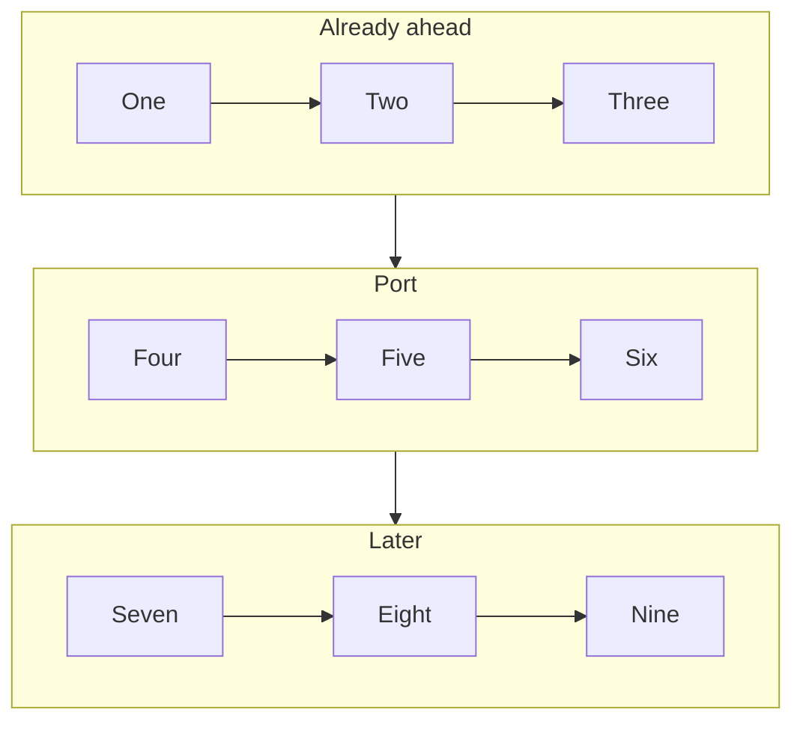

Before the tall fence.

```mermaid
flowchart TB
  subgraph keep [Already ahead]
    A[One] --> B[Two]
    B --> C[Three]
  end
  subgraph port [Port]
    D[Four] --> E[Five]
    E --> F[Six]
  end
  subgraph later [Later]
    G[Seven] --> H[Eight]
    H --> I[Nine]
  end
  keep --> port --> later
```

After the tall fence.
